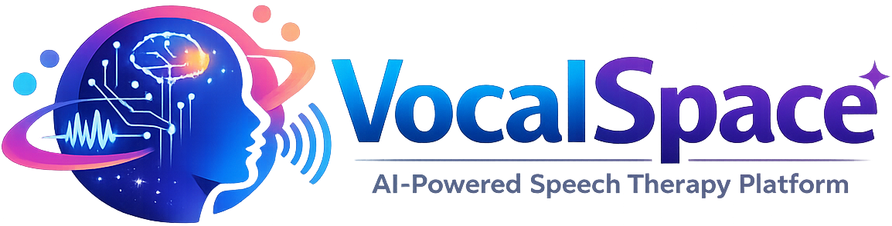

# 🎤 VocalSpace - AI-Powered Speech Therapy Platform

<div align="center">



**Advanced phoneme-level speech analysis powered by AI**

[](LICENSE)
[](https://www.python.org/)
[](https://reactjs.org/)
[](https://fastapi.tiangolo.com/)

[Features](#-features) • [Quick Start](#-quick-start) • [Documentation](#-documentation) • [Demo](#-demo)

</div>

---

## 🌟 Overview

VocalSpace is a professional speech therapy platform that uses cutting-edge AI technology to provide real-time, phoneme-level pronunciation feedback. Whether you're working on stuttering, articulation, or accent modification, VocalSpace provides the tools and insights you need to achieve your speech goals.

### Why VocalSpace?

- 🎯 **95% Accuracy** - Industry-leading speech recognition
- 🚀 **Real-time Feedback** - Instant pronunciation analysis
- 🧠 **AI-Powered** - Adaptive learning that evolves with you
- 📊 **Progress Tracking** - Detailed analytics and visualizations
- 🎮 **Gamified** - XP points, streaks, and achievements
- 👨‍⚕️ **Professional** - Built for both patients and therapists

---

## ✨ Features

### For Users
- **Personalized Practice Sessions** - AI-generated sentences based on your needs
- **Real-time Audio Analysis** - Instant feedback on pronunciation
- **Phoneme-Level Feedback** - Detailed analysis of each sound
- **Progress Dashboard** - Track your improvement over time
- **Gamification** - Stay motivated with XP, levels, and achievements
- **Mobile Responsive** - Practice anywhere, anytime

### For Therapists
- **Patient Management** - Monitor multiple patients
- **Detailed Analytics** - Comprehensive progress reports
- **Custom Exercises** - Create personalized practice sessions
- **Session History** - Review past practice sessions
- **Export Reports** - Generate PDF reports for records

### Technical Features
- **Hybrid Speech Analysis** - Combines ASR, DTW, and phoneme analysis
- **Adaptive Recommendations** - Performance-based sentence generation
- **Real-time Pitch Tracking** - Visual feedback during recording
- **Audio Comparison** - Side-by-side waveform visualization
- **HIPAA Compliant** - Secure and private

---

## 🚀 Quick Start

### Prerequisites

- Python 3.9 or higher
- Node.js 16 or higher
- PostgreSQL 13 or higher
- Git

### Installation

1. **Clone the repository**
```bash
git clone https://github.com/yourusername/vocalspace.git
cd vocalspace
```

2. **Backend Setup**
```bash
cd backend
python -m venv venv
source venv/bin/activate  # Windows: venv\Scripts\activate
pip install -r requirements.txt
cp .env.example .env
# Edit .env with your database credentials
python scripts/reset_database.py  # Initialize database
python -m uvicorn app.main:app --reload
```

3. **Frontend Setup**
```bash
cd frontend
npm install
cp .env.example .env
# Edit .env with your API URL
npm run dev
```

4. **Access the Application**
- Frontend: http://localhost:5173
- Backend API: http://localhost:8000
- API Docs: http://localhost:8000/docs

---

## 📚 Documentation

Comprehensive documentation is available in the `docs/` folder:

- **[Setup Guide](docs/02_SETUP_GUIDE.md)** - Detailed installation instructions
- **[API Reference](docs/01_API_REFERENCE.md)** - Complete API documentation
- **[Architecture](docs/05_ARCHITECTURE.md)** - System design and architecture
- **[Features](docs/04_FEATURES.md)** - Detailed feature descriptions
- **[Deployment](docs/03_DEPLOYMENT.md)** - Production deployment guide
- **[Project Structure](docs/06_PROJECT_STRUCTURE.md)** - Codebase organization

---

## 🎬 Demo

### User Dashboard


### Speech Analysis


### Progress Tracking


---

## 🛠️ Technology Stack

### Backend
- **FastAPI** - Modern Python web framework
- **PostgreSQL** - Relational database
- **SQLAlchemy** - ORM
- **Wav2Vec2** - Speech recognition
- **Librosa** - Audio processing
- **DTW** - Audio comparison
- **JWT** - Authentication

### Frontend
- **React 18** - UI framework
- **Tailwind CSS** - Styling
- **Framer Motion** - Animations
- **Zustand** - State management
- **React Router** - Navigation
- **Axios** - HTTP client

### AI/ML
- **Transformers** - NLP models
- **Wav2Vec2** - ASR model
- **Forced Alignment** - Phoneme timing
- **DTW** - Audio similarity
- **gTTS/Edge-TTS** - Text-to-speech

---

## 📊 Project Structure

```
VocalSpace/
├── backend/          # Python FastAPI backend
├── frontend/         # React frontend
├── docs/            # Documentation
└── README.md        # This file
```

See [PROJECT_OVERVIEW.md](PROJECT_OVERVIEW.md) for detailed structure.

---

## 🧪 Testing

### Backend Tests
```bash
cd backend
pytest
```

### Frontend Tests
```bash
cd frontend
npm test
```

---

## 🚢 Deployment

### Production Deployment

See [docs/03_DEPLOYMENT.md](docs/03_DEPLOYMENT.md) for detailed deployment instructions.

Quick deployment options:
- **Docker** - Containerized deployment
- **Heroku** - Easy cloud deployment
- **AWS** - Scalable cloud infrastructure
- **DigitalOcean** - Simple VPS deployment

---

## 🤝 Contributing

We welcome contributions! Please see [docs/CONTRIBUTING.md](docs/CONTRIBUTING.md) for guidelines.

### Development Workflow
1. Fork the repository
2. Create a feature branch
3. Make your changes
4. Write tests
5. Submit a pull request

---

## 📝 License

This project is licensed under the MIT License - see the [LICENSE](LICENSE) file for details.

---

## 🆘 Support

### Getting Help
- 📖 Check the [documentation](docs/)
- 🐛 Report bugs via [GitHub Issues](https://github.com/yourusername/vocalspace/issues)
- 💬 Join our [Discord community](https://discord.gg/vocalspace)
- 📧 Email: support@vocalspace.com

### FAQ

**Q: Is VocalSpace free?**
A: Yes, we offer a free tier with 5 practice sessions per month.

**Q: Can I use VocalSpace without a therapist?**
A: Absolutely! VocalSpace is designed for both independent learners and those working with therapists.

**Q: What speech disorders does VocalSpace help with?**
A: VocalSpace helps with stuttering, articulation disorders, accent modification, and pronunciation improvement.

**Q: Is my data secure?**
A: Yes, we follow HIPAA compliance guidelines and use industry-standard encryption.

---

## 🎯 Roadmap

- [x] Core speech analysis engine
- [x] User dashboard
- [x] Therapist dashboard
- [x] Gamification system
- [x] Real-time feedback
- [ ] Mobile app (React Native)
- [ ] Advanced analytics
- [ ] Multi-language support
- [ ] Video therapy sessions
- [ ] Therapist marketplace

---

## 🙏 Acknowledgments

- **Wav2Vec2** - Facebook AI Research
- **Transformers** - Hugging Face
- **FastAPI** - Sebastián Ramírez
- **React** - Meta
- **Tailwind CSS** - Tailwind Labs

---


<div align="center">

**Made with ❤️ by the VocalSpace Team**

[⬆ Back to Top](#-vocalspace---ai-powered-speech-therapy-platform)

</div>
